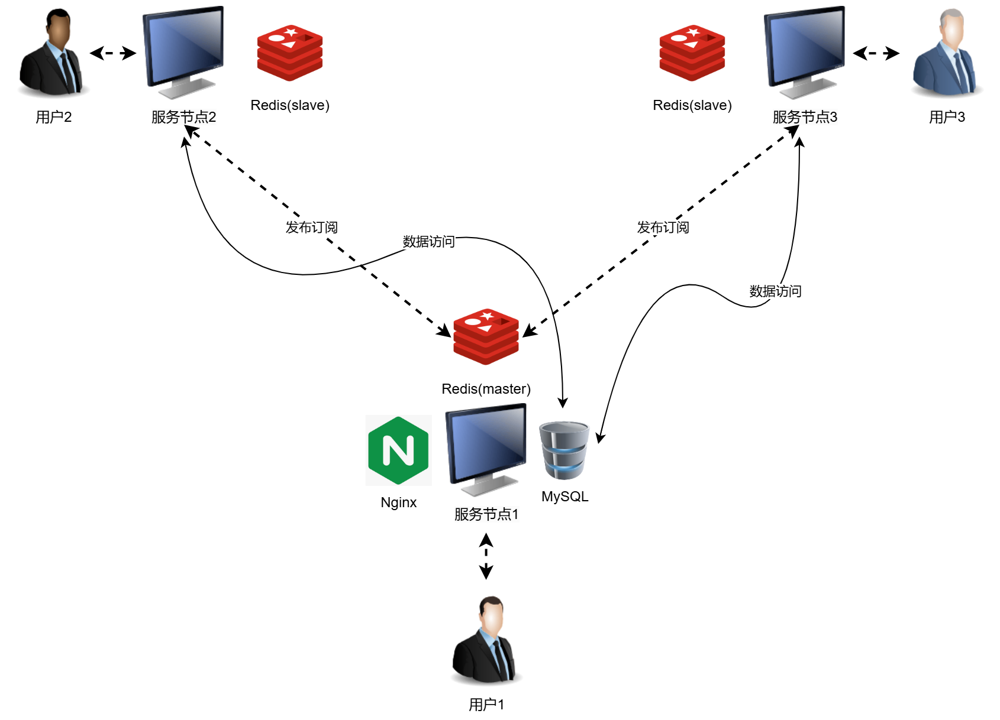

# ChatServer

## 简介
这是一个基于Muduo库实现的集群聊天服务器项目：采用模块化设计，实现解耦的业务处理与网络模块；使用Nginx实现多个服务器节点的负载均衡；使用主从复制集群模式的Redis作为缓存数据库并充当服务器节点之间通信的消息中间件；基本实现了用户登录注册、添加好友、加入群聊、好友聊天、群组聊天、离线消息存储等功能。

## 项目架构


## 使用

### 依赖环境
* `ubuntu18.04`
* `cmake(version >= 2.6)`
* `g++(version >= 4.1)`
* `muduo`
* `redis(version >= 4.0)`
* `hiredis`
* `nginx(version >= 1.9)`

### 项目运行配置

#### MySQL表配置
```
mysql -u [user] -p [password]
create database chat;
source chat.sql
```

#### MySQL和Redis连接配置
```
chatserver/include/server/mysql/connectionpool.hpp
chatserver/src/server/redis/redis.cpp
```

#### Nginx配置
```
cd /usr/local/nginx/conf/
vim nginx.conf
添加tcp负载均衡模块, 配置不同服务器的ip和端口
```

#### Redis主从复制从节点配置
```
cd /etc/redis
vim redis.conf
添加: slaveof 主节点ip 主节点port
```

### 项目拉取和编译
```
git clone https://github.com/colinnsong/chatserver.git  
cd chatserver  
mkdir build  
cd build  
cmake ..  
make  
```

### 启动服务器
```
cd ../bin  
./ChatServer 本机ip 自定义port(需和Nginx中的ip和port一致)
```

### 启动客户端
```
cd ../bin  
./ChatClient nginx负载均衡器ip nginx监听port
```
